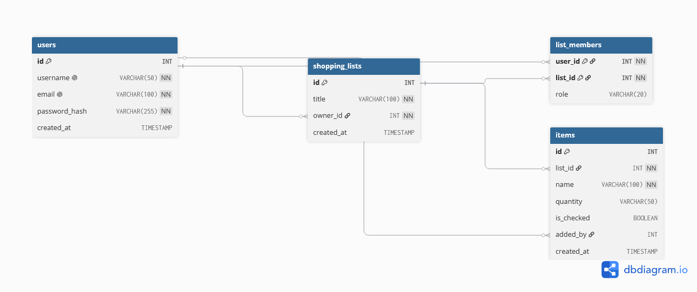

# Einkaufsliste-Projekt

## Inhaltsverzeichnis

* [Über das Projekt](#über-das-projekt)
* [Voraussetzungen](#voraussetzungen)
* [Installation](#installation)
* [Datenbank](#datenbank)
* [SQL → DBML](#sql--dbml)
* [Datenbankmodell](#datenbankmodell)
* [Projektstruktur](#projektstruktur)
* [Verwendung](#verwendung)
* [Entwicklung](#entwicklung)
* [Quellen](#quellen)

---

## Über das Projekt

*Hier wird später kurz beschrieben, worum es bei dem Projekt geht und welchen Zweck es erfüllt.*

---

## Voraussetzungen

*Hier werden später benötigte Programme, Versionen und Abhängigkeiten eingetragen.*

Beispielsweise:

* Node.js
* npm
* MySQL / MariaDB
* Git
* [dbdiagram.io](https://dbdiagram.io/)

---

## Installation

*Hier werden später die notwendigen Schritte zur Einrichtung des Projekts beschrieben.*

### Abhängigkeiten installieren

```bash
npm install
```

---

## Datenbank

*Hier werden später Informationen zur verwendeten Datenbank dokumentiert.*

### Datenbanksystem

*Zum Beispiel: MySQL / MariaDB*

### Datenbank erstellen

*Hier können später die notwendigen SQL-Befehle ergänzt werden.*

### Datenbankstruktur

*Hier kann später die Struktur der Datenbank beschrieben oder auf die entsprechende Datei verwiesen werden.*

---

## SQL → DBML

Um eine vorhandene SQL-Datei für [dbdiagram.io](https://dbdiagram.io/) zu verwenden, kann sie mit **sql2dbml** in das **DBML-Format** umgewandelt werden.

### 1. DBML CLI installieren

Zuerst wird das benötigte CLI-Tool über npm installiert:

```bash
npm install -g @dbml/cli
```

### 2. SQL-Datei konvertieren

Anschließend wird die SQL-Datei in eine DBML-Datei umgewandelt:

```bash
sql2dbml --mysql db.sql -o db.dbml
```

Dabei gilt:

* `db.sql` – die vorhandene SQL-Datei
* `db.dbml` – die erzeugte DBML-Datei
* `--mysql` – gibt an, dass die SQL-Datei MySQL-Syntax verwendet

Die erzeugte `db.dbml` kann anschließend in [dbdiagram.io](https://dbdiagram.io/) importiert werden, um das Datenbankschema grafisch darzustellen.

---

## Datenbankmodell

Das Datenbankmodell wurde mit [dbdiagram.io](https://dbdiagram.io/) erstellt.

Das Diagramm dient zur grafischen Darstellung der Tabellen, Attribute und
Beziehungen der Datenbank.



---

## Projektstruktur

## Projektstruktur

Die Projektstruktur ist wie folgt aufgebaut:

```text
Projekt/
├── AddToListForm.html
├── db.sql
├── index.html
├── insert_items.php
├── newUserRegistration.php
├── README.md
├── registrationHTML.html
├── SuccessfulRegistration.html
│
├── assets/
│   ├── fonts/
│   ├── icons/
│   └── img/
│
├── docs/
│   ├── database-diagram.png
│   ├── database-diagram.svg
│   │
│   ├── dbml/
│   │   ├── db.dbml
│   │   └── dbml-error.log
│   │
│   └── sample-data/
│       └── sample-data.json
│
├── scripts/
│   ├── list.js
│   └── script.js
│
└── styles/
    ├── lists.css
    ├── responsive.css
    ├── root.css
    ├── standard.css
    └── style.css
```

---

## Verwendung

*Hier wird später erklärt, wie das Projekt verwendet bzw. gestartet wird.*

### Starten

```bash
...
```

### Weitere Befehle

```bash
...
```

---

## Entwicklung

*Hier können später Informationen für die Weiterentwicklung des Projekts ergänzt werden.*

### Git

*Hier können später Git-Befehle und der Workflow für das Projekt dokumentiert werden.*

### Änderungen

*Hier können später Regeln für Änderungen, Branches, Commits oder Pull Requests ergänzt werden.*

---

## Bekannte Probleme

*Hier werden später bekannte Fehler oder Einschränkungen dokumentiert.*

---

## Quellen

* [DBML CLI – Dokumentation](https://dbml.dbdiagram.io/cli/)
* [dbdiagram.io](https://dbdiagram.io/)
* [Emojicombos – Vertical Ellipsis](https://emojicombos.com/vertical-ellipsis)
* [HotSymbol – Vertical Ellipsis](https://www.hotsymbol.com/symbol/vertical-ellipsis)

---

## Lizenz

*Hier kann später die verwendete Lizenz eingetragen werden.*
